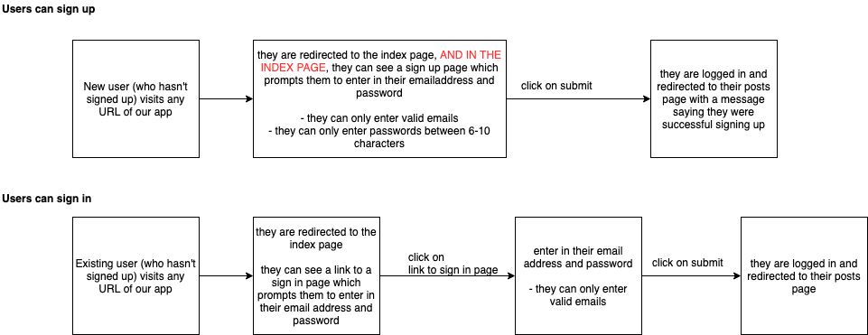

# AceBook


AceBook is a social media web app where users can sign in and post messages. It was developed over the course of two weeks by a team of 4 using Agile (Scrum) best practices.
Visit [AceBook](https://acebook-fantastic-four.herokuapp.com/) to see the app in action.
* You can sign up by entering a valid email address and a password meeting certain criteria.
* You can see a list of past posts.
* You can create a post and it will be displayed in a clear format.

## Instructions for new developers:

1. Request to be added as a contributer to the project.
2. Clone the project into your local repo.
3. Navigate into the project directory.
4. Run the following in your terminal:
```bash
> bundle install
> bin/rails db:create
> bin/rails db:migrate
```
5. To run the test suite for the app:
```bash
> rspec
```
7. To run the linter for the app:
```bash
> rubocop
```
8. Running a local server:
```bash
> bin/rails server # Start the server at localhost:3000
```
9. [Use the Project Trello board to complete the tasks assigned to you by the Scrum Master.](https://trello.com/b/1NSTnYaN/fantastic-four-acebook)
10. If you are joining the team then please remove another member of the team or change the team name.

## Tech Stack

In order to learn a new technology the project was developed using the Ruby on Rails framework.
* Continuous Integration: Travis CI.
* Linter: Rubocop.
* Testing Framework: RSpec, Capybara, Simplecov.
* Deployment: Heroku.

## Development Notes

User Journey upon sign-up/sign-in:


AceBook MVC Structure:


<sub>_Image taken from http://img.hexus.net/v2/gaming/fantastic_4/f4_1.jpg_</sub>
